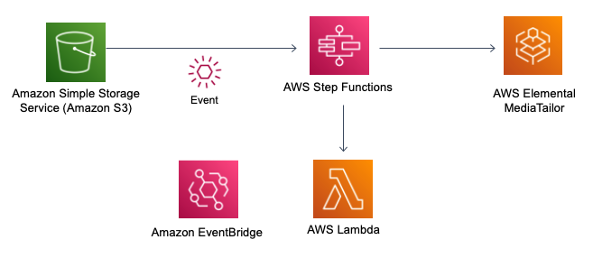

# AWS MediaTailor VOD Source bulk uploads

<em>This demo workflow automates adding VOD sources to [AWS MediaTailor](https://aws.amazon.com/mediatailor/) Channel Assembly. Further details are available at this [AWS Media blog post](https://aws.amazon.com/blogs/media/automating-vod-sources-for-aws-elemental-mediatailor/) </em>

The AWS Serverless Application Model ([SAM](https://aws.amazon.com/serverless/sam/)) template deploys an [Amazon S3](https://aws.amazon.com/s3/) bucket that publishes events to [Amazon EventBridge](https://aws.amazon.com/eventbridge/) which triggers an [AWS Step Function](https://aws.amazon.com/step-functions). This includes an [AWS Lambda](https://aws.amazon.com/lambda/) function with Python code that converts CSV to JSON. Template includes the [AWS IAM](https://aws.amazon.com/iam/) policies required to run the application, but is not ready for production workloads.

To learn about AWS MediaTailor Channel Assembly, this [workshop](https://catalog.us-east-1.prod.workshops.aws/workshops/caf0d459-d860-414e-8216-bf136b2b789b/en-US/) walks through defining sources, creating a channel and programs along with test source content. 

Important: this application uses various AWS services and there are costs associated with these services after the Free Tier usage - please see the [AWS Pricing page](https://aws.amazon.com/pricing/) for details. You are responsible for any AWS costs incurred. No warranty is implied in this example.


## Architecture

### This project is intended for education purposes only and not for production usage.




## Requirements

* [Create an AWS account](https://portal.aws.amazon.com/gp/aws/developer/registration/index.html) if you do not already have one and log in. The IAM user that you use must have sufficient permissions to make necessary AWS service calls and manage AWS resources.
* [AWS CLI](https://docs.aws.amazon.com/cli/latest/userguide/install-cliv2.html) installed and configured
* [Git Installed](https://git-scm.com/book/en/v2/Getting-Started-Installing-Git)
* [AWS Serverless Application Model](https://docs.aws.amazon.com/serverless-application-model/latest/developerguide/serverless-sam-cli-install.html) (AWS SAM) installed

## Deployment Instructions

1. Create a new directory, navigate to that directory in a terminal and clone the GitHub repository:
    ```
    git clone git@github.com:aws-samples/mediatailor-vod-upload.git
    ```
1. Change directory to the directory:
    ```
    cd mediatailor-vod-upload
    ```
1. From the command line, use AWS SAM to build and deploy the AWS resources for the pattern as specified in the template.yml file:
    ```
    sam deploy --guided
    ```
1. During the prompts:
    * Enter a stack name
    * Enter the desired AWS Region
    * Enter the email address to receive notifications of workflow results
    * Allow SAM CLI to create IAM roles with the required permissions.

    Once you have run `sam deploy --guided` mode once and saved arguments to a configuration file (samconfig.toml), you can use `sam deploy` in future to use these defaults.

    Example parameters (you must change these for your account):

            Setting default arguments for 'sam deploy'
        =========================================
        Stack Name [CABulkUpload]: 
        AWS Region [ap-southeast-2]: 
        Parameter SNSEndpoint [test@test.com]: 
        #Shows you resources changes to be deployed and require a 'Y' to initiate deploy
        Confirm changes before deploy [y/N]: y
        #SAM needs permission to be able to create roles to connect to the resources in your template
        Allow SAM CLI IAM role creation [Y/n]: y
        #Preserves the state of previously provisioned resources when an operation fails
        Disable rollback [y/N]: n
        Save arguments to configuration file [Y/n]: y
        SAM configuration file [samconfig.toml]: 
        SAM configuration environment [default]: 

1. Note the outputs from the SAM deployment process. These contain the S3 bucket to upload CSV file to and the Step Function to monitor workflow. 

## How it works

Note if you are following the AWS MediaTailor [workshop](https://catalog.us-east-1.prod.workshops.aws/workshops/caf0d459-d860-414e-8216-bf136b2b789b/en-US/) - you can use `workshop.csv` to test, after first creating source location `WorkshopTest` = ` https://channelassembly.videocloud.live`

* Upload a CSV file to the created S3 bucket.
* The Step Function is invoked with the event from S3, routed via EventBridge
* Lambda loads the source csv file and converts to JSON data format
* Step Function iterates through each VOD source using a map function to call MediaTailor VodSource API
* Notification email is raised at completion of workflow

## Limits

MediaTailor resources and operations requests have quotas per https://docs.aws.amazon.com/mediatailor/latest/ug/quotas.html, so the following limits are applied to this sample workflow. 

* maximum VOD assets of 500
* maximum 10 requests per second to MediaTailor API

## Example CSV

```
SourceLocation,VodSourceName,SourceGroup,Type,Path
MySourceLocation1,MyFirstVodSource,hls,HLS,/path/to/my/first/source.m3u8
MySourceLocation1,MyFirstVodSource,dash,DASH,/path/to/my/first/source.mpd
MySourceLocation1,MySecondVodSource,hls,HLS,/path/to/my/second/source.m3u8
MySourceLocation1,MySecondVodSource,dash,DASH,/path/to/my/second/source.mpd
```


## Example payload

The event delivered to the EventBridge rule target (a Lambda function in this example) has the following structure:

```
   {
  "version": "0",
  "id": "xxxx",
  "detail-type": "Object Created",
  "source": "aws.s3",
  "account": "xxxxxxxx",
  "time": "2022-01-20T03:45:42Z",
  "region": "ap-southeast-2",
  "resources": [
    "arn:aws:s3:::xxxxxx"
  ],
  "detail": {
    "version": "0",
    "bucket": {
      "name": "cabulkupload-sourcebucket-xxxxx"
    },
    "object": {
      "key": "workshop.csv",
      "size": 192,
      "etag": "xxx",
      "sequencer": "xxxx"
    },
    "request-id": "xxxx",
    "requester": "xxxxxx",
    "source-ip-address": "xxxx",
    "reason": "PutObject"
  }
}
```

## Testing

1. Run the following S3 CLI command to upload an object to the S3 bucket. Note, you must edit the *SourceBucketName* placeholder with the name of the S3 Bucket. This is provided in the stack outputs.

```bash
aws s3 cp './test.csv'  s3://*SourceBucketName*
```

2. Run the following command to check to get the logs from the deployed Lambda function (use the function name from the stack output):

```bash
sam logs -n *FunctionName* --region *YourRegion*
```

## Cleanup

1. Delete the stack
    ```bash
   sam delete
    ```


## Security

See [CONTRIBUTING](CONTRIBUTING.md#security-issue-notifications) for more information.

## License

This library is licensed under the MIT-0 License. See the LICENSE file.


